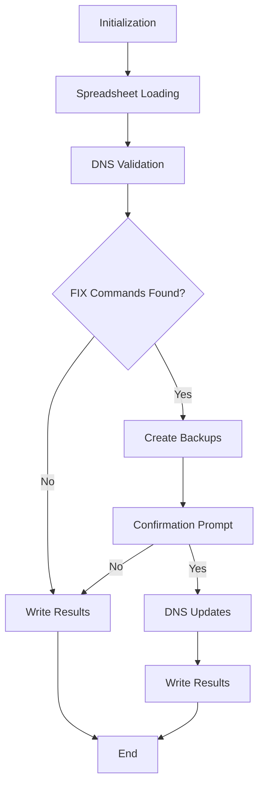

# Design Document: DNS-Update

## Overview

DNS-Update is a PowerShell-based tool that automates DNS validation and updates by processing Excel spreadsheets containing DNS entries. The program validates forward and reverse DNS records against a Microsoft DNS server, identifies discrepancies, and allows administrators to update DNS records by marking validation cells with "FIX". The program operates iteratively on the same spreadsheet until all entries are validated as correct.

The design emphasizes safety through backup operations, confirmation prompts, and update limits. The program is built using native PowerShell cmdlets for DNS operations and the ImportExcel module for spreadsheet handling, ensuring efficient integration with Windows Server environments.

## Architecture

The program follows a pipeline architecture with distinct stages:



### Key Architectural Decisions

1. **PowerShell Native**: Uses PowerShell cmdlets (Get-DnsServerResourceRecord, Set-DnsServerResourceRecord) for DNS operations to leverage native Windows DNS integration
2. **Single-Pass Processing**: Processes the spreadsheet in a single pass, performing validation and collecting FIX commands before any updates
3. **Batch Updates with Confirmation**: Collects all FIX commands, displays them for review, and executes them in batch after user confirmation
4. **Stateless Execution**: Each program run is independent; state is maintained only in the spreadsheet
5. **Safety-First**: Multiple backup formats and confirmation prompts prevent accidental changes

## Components and Interfaces

### 1. Configuration Manager

**Responsibility**: Load and manage program configuration from INI file

**Interface**:
```powershell
class ConfigurationManager {
    [string] $DnsServer
    [string] $DomainSuffix
    [string] $LogDirectory
    [int] $UpdateLimit
    [string] $DefaultSpreadsheetFilename
    [bool] $ReadOnlyMode
    
    [void] LoadConfiguration([string] $iniFilePath)
    [void] CreateDefaultConfiguration([string] $iniFilePath)
    [string] GetDnsServer()
    [string] GetDomainSuffix()
    [string] GetLogDirectory()
    [int] GetUpdateLimit()
    [string] GetDefaultSpreadsheetFilename()
    [bool] GetReadOnlyMode()
}
```

**Behavior**:
- Reads INI file using PowerShell's Get-Content and parsing
- Creates default INI file with all options if file doesn't exist (ReadOnlyMode defaults to true)
- Provides accessor methods for configuration values
- Uses default values if configuration keys are missing

### 2. Spreadsheet Manager

**Responsibility**: Read, write, and manage Excel spreadsheet operations

**Interface**:
```powershell
class SpreadsheetManager {
    [string] $FilePath
    [object] $WorksheetData
    [hashtable] $ColumnMapping
    
    [bool] FileExists([string] $filePath)
    [void] CreateSampleSpreadsheet([string] $filePath)
    [void] LoadSpreadsheet([string] $filePath)
    [void] SaveSpreadsheet([string] $filePath)
    [void] MapColumns()
    [array] GetRows()
    [void] UpdateCell([int] $row, [string] $column, [string] $value)
    [string] GetCellValue([int] $row, [string] $column)
    [void] AddStatusColumn()
}
```

**Behavior**:
- Uses ImportExcel module (Import-Excel, Export-Excel cmdlets)
- Creates sample spreadsheet with local host information using Get-NetIPAddress and hostname
- Maps column names to indices for flexible column ordering
- Validates required columns exist
- Preserves additional columns during read/write operations

### 3. DNS Validator

**Responsibility**: Validate forward and reverse DNS records against DNS server

**Interface**:
```powershell
class DnsValidator {
    [string] $DnsServer
    [string] $DomainSuffix
    
    [hashtable] ValidateForwardDns([string] $hostname, [string] $expectedIp)
    [hashtable] ValidateReverseDns([string] $ipAddress, [string] $expectedHostname)
    [string] NormalizeHostname([string] $hostname)
    [bool] TestDnsConnectivity()
    [string] DetectZone([string] $hostnameOrIp)
}
```

**Behavior**:
- Uses Get-DnsServerResourceRecord cmdlet for queries
- Appends domain suffix to short names
- Performs case-insensitive comparisons
- Returns validation results as hashtable with keys: Success (YES/NO/FAIL/MULTIPLE), ResolvedValue
- Handles multiple A/PTR records by checking if any match
- Detects DNS zones using Get-DnsServerZone cmdlet

### 4. DNS Updater

**Responsibility**: Create and update DNS records on the DNS server

**Interface**:
```powershell
class DnsUpdater {
    [string] $DnsServer
    [int] $UpdateLimit
    [int] $UpdateCount
    [bool] $ReadOnlyMode
    
    [hashtable] UpdateARecord([string] $hostname, [string] $ipAddress, [string] $zone)
    [hashtable] UpdatePtrRecord([string] $ipAddress, [string] $hostname, [string] $zone)
    [bool] RecordExists([string] $recordName, [string] $zone, [string] $recordType)
    [bool] HasMultipleRecords([string] $recordName, [string] $zone, [string] $recordType)
    [bool] CanUpdate()
    [void] IncrementUpdateCount()
}
```

**Behavior**:
- Uses Set-DnsServerResourceRecord cmdlet for updates (unless ReadOnlyMode is true)
- Uses Add-DnsServerResourceRecord cmdlet for creation (unless ReadOnlyMode is true)
- When ReadOnlyMode is true, skips all DNS update operations and logs that updates were skipped
- When ReadOnlyMode is true, still validates what would be updated and returns simulated results
- Checks for existing records before update/create decision
- Enforces update limit per run
- Returns update results as hashtable with keys: Success (bool), Status (Updated/Failed/MULTIPLE/ReadOnly)

### 5. Backup Manager

**Responsibility**: Create backup exports before DNS changes

**Interface**:
```powershell
class BackupManager {
    [string] $LogDirectory
    
    [void] CreateBackups([object] $worksheetData, [string] $dnsServer)
    [string] GenerateTimestamp()
    [void] ExportToExcel([object] $data, [string] $filePath)
    [void] ExportToCsv([object] $data, [string] $filePath)
    [void] ExportToClixml([object] $data, [string] $filePath)
}
```

**Behavior**:
- Creates three backup formats: Excel, CSV, PowerShell Clixml
- Uses timestamp format YYYYMMDD-HH-MM (24-hour)
- Saves backups to configured log directory
- Exports current DNS records using Get-DnsServerResourceRecord before changes

### 6. Logger

**Responsibility**: Log program operations, queries, updates, and errors

**Interface**:
```powershell
class Logger {
    [string] $LogFilePath
    
    [void] Initialize([string] $logDirectory)
    [void] LogInfo([string] $message)
    [void] LogError([string] $message)
    [void] LogQuery([string] $queryType, [string] $target, [string] $result)
    [void] LogUpdate([string] $recordType, [string] $target, [string] $result)
    [void] LogAction([string] $action, [string] $details)
}
```

**Behavior**:
- Creates log file with timestamp format YYYYMMDD-HH-MM
- Writes timestamped log entries
- Categorizes log entries by type (INFO, ERROR, QUERY, UPDATE, ACTION)
- Uses Add-Content for appending to log file

### 7. Progress Display

**Responsibility**: Display progress information to user

**Interface**:
```powershell
class ProgressDisplay {
    [int] $TotalRows
    [int] $CurrentRow
    
    [void] Initialize([int] $totalRows)
    [void] UpdateProgress([int] $currentRow)
    [void] ShowConfirmation([array] $fixCommands)
    [bool] GetUserConfirmation()
}
```

**Behavior**:
- Shows progress only if more than 10 rows
- Uses Write-Progress cmdlet for progress bar
- Displays FIX commands in table format for confirmation
- Uses Read-Host for Y/N confirmation prompt

### 8. Main Orchestrator

**Responsibility**: Coordinate all components and execute the main program flow

**Interface**:
```powershell
class MainOrchestrator {
    [ConfigurationManager] $Config
    [SpreadsheetManager] $Spreadsheet
    [DnsValidator] $Validator
    [DnsUpdater] $Updater
    [BackupManager] $Backup
    [Logger] $Log
    [ProgressDisplay] $Progress
    
    [void] Run([string[]] $args)
    [void] Initialize([string[]] $args)
    [void] ValidatePrerequisites()
    [void] ProcessSpreadsheet()
    [void] ValidateRow([int] $rowIndex)
    [void] CollectFixCommands()
    [void] ExecuteFixCommands([array] $fixCommands)
}
```

**Behavior**:
- Parses command line arguments
- Initializes all components
- Validates PowerShell modules (DnsServer, ImportExcel)
- Validates DNS connectivity
- Processes spreadsheet row by row
- Collects FIX commands during validation
- Creates backups and prompts for confirmation before updates
- Writes results back to spreadsheet

## Data Models

### SpreadsheetRow

Represents a single row in the spreadsheet:

```powershell
class SpreadsheetRow {
    [int] $RowNumber
    [string] $Hostname
    [string] $IpAddress
    [string] $ForwardDnsSuccess
    [string] $ForwardDnsResolvedIp
    [string] $ReverseDnsSuccess
    [string] $ReverseDnsHostname
    [string] $Status
}
```

### ValidationResult

Represents the result of a DNS validation:

```powershell
class ValidationResult {
    [string] $Success  # YES, NO, FAIL, MULTIPLE
    [string] $ResolvedValue
    [string] $ErrorMessage
}
```

### FixCommand

Represents a DNS update operation to be performed:

```powershell
class FixCommand {
    [int] $RowNumber
    [string] $RecordType  # A or PTR
    [string] $Hostname
    [string] $IpAddress
    [string] $Zone
}
```

### Configuration

Represents program configuration:

```powershell
class Configuration {
    [string] $DnsServer = "eit-priaddc00"
    [string] $DomainSuffix = ".tgna.tegna.com"
    [string] $LogDirectory = "./logs"
    [int] $UpdateLimit = 5
    [string] $DefaultSpreadsheetFilename = "DNS_Validation.xlsx"
    [bool] $ReadOnlyMode = $true
}
```

## Correctness Properties

*A property is a characteristic or behavior that should hold true across all valid executions of a system—essentially, a formal statement about what the system should do. Properties serve as the bridge between human-readable specifications and machine-verifiable correctness guarantees.*


### Property 1: Column Order Independence
*For any* spreadsheet with required columns in any order, the program should correctly identify and process all columns by name.
**Validates: Requirements 1.5**

### Property 2: Additional Column Preservation
*For any* spreadsheet with additional columns beyond the required set, those additional columns should remain unchanged after processing (invariant).
**Validates: Requirements 1.7**

### Property 3: Required Column Validation
*For any* spreadsheet missing one or more required columns, the program should terminate with an error message specifying which columns are missing.
**Validates: Requirements 1.8**

### Property 4: Empty Row Handling
*For any* spreadsheet row with empty Hostname or IP Address, that row should be skipped and marked with "Skipped" in the Status column.
**Validates: Requirements 1.9**

### Property 5: Spreadsheet Round-Trip
*For any* spreadsheet processed by the program, all validation results and status updates should be written back to the same file.
**Validates: Requirements 1.11**

### Property 6: Hostname Normalization
*For any* short hostname (without domain suffix), the program should append the configured domain suffix before DNS queries.
**Validates: Requirements 2.3**

### Property 7: Case-Insensitive Comparison
*For any* hostname or DNS result with different casing, comparisons should treat them as equivalent (e.g., "SERVER" equals "server").
**Validates: Requirements 2.4**

### Property 8: Forward DNS Validation Logic
*For any* hostname and IP address pair, if the DNS query returns an IP matching the spreadsheet IP (or any IP in case of multiple A records), the validation result should be "YES"; otherwise "NO" or "MULTIPLE" as appropriate.
**Validates: Requirements 2.5, 2.6, 2.8, 2.9**

### Property 9: Reverse DNS Validation Logic
*For any* IP address and hostname pair, if the reverse DNS query returns a hostname matching the spreadsheet hostname (or any hostname in case of multiple PTR records), the validation result should be "YES"; otherwise "NO" or "MULTIPLE" as appropriate.
**Validates: Requirements 2.10, 2.11, 2.13, 2.14**

### Property 10: Empty Cell Triggers Validation
*For any* row with empty validation cells (Forward DNS Success or Reverse DNS Success), the program should perform validation for those DNS types.
**Validates: Requirements 2.15**

### Property 11: Resolved Values Written
*For any* DNS validation performed, the resolved IP address should be written to Forward DNS Resolved IP column and resolved hostname to Reverse DNS Hostname column.
**Validates: Requirements 2.16, 2.17**

### Property 12: FIX Command Case Insensitivity
*For any* validation cell containing "FIX" in any case combination (FIX, fix, Fix, fIx, etc.), the program should trigger the appropriate DNS update operation.
**Validates: Requirements 3.1, 3.2**

### Property 13: DNS Record Update
*For any* existing DNS record with incorrect value and FIX command, the record should be updated to match the spreadsheet value.
**Validates: Requirements 3.4, 3.6**

### Property 14: Update Limit Enforcement
*For any* program run with N FIX commands where N exceeds the configured update limit, only the first [limit] updates should be performed, but all rows should still be validated.
**Validates: Requirements 3.8, 3.9**

### Property 15: DNS Zone Auto-Detection
*For any* hostname or IP address, the program should correctly detect the appropriate DNS zone for that record.
**Validates: Requirements 3.10**

### Property 16: Backup Before Changes
*For any* program run with FIX commands, backups should be created before any DNS changes are made.
**Validates: Requirements 4.1**

### Property 17: Complete Backup Set
*For any* backup operation, three files should be created: timestamped Excel file, CSV file, and PowerShell Clixml file, all with filename format YYYYMMDD-HH-MM.
**Validates: Requirements 4.2, 4.3**

### Property 18: Confirmation Prompt Content
*For any* program run with FIX commands, the confirmation prompt should display all records to be updated before proceeding.
**Validates: Requirements 4.4**

### Property 19: User Confirmation Controls Updates
*For any* confirmation prompt, responding "N" should skip all updates while continuing validation, and responding "Y" should proceed with updates.
**Validates: Requirements 4.5, 4.6**

### Property 20: Configuration File Auto-Creation
*For any* program run where the INI file does not exist, the program should create it with all default options (including ReadOnlyMode=true) and non-default options commented out.
**Validates: Requirements 5.11, 5.12**

### Property 21: Configuration Defaults
*For any* configuration option not specified in the INI file, the program should use the documented default value (DNS server: eit-priaddc00, domain suffix: .tgna.tegna.com, log directory: ./logs, update limit: 5, spreadsheet: DNS_Validation.xlsx, read-only mode: true).
**Validates: Requirements 5.2, 5.3, 5.4, 5.5, 5.6, 5.7**

### Property 27: Read-Only Mode Safety
*For any* program run with ReadOnlyMode set to true, no DNS update operations (Set-DnsServerResourceRecord or Add-DnsServerResourceRecord) should be executed, but all validation and display operations should proceed normally.
**Validates: Requirements 5.8, 5.9, 5.10**

### Property 22: Log File Format and Location
*For any* program run, a log file should be created with filename format YYYYMMDD-HH-MM in the configured log directory.
**Validates: Requirements 6.1, 6.2**

### Property 23: Complete Logging
*For any* program run, all DNS queries, updates, errors, and actions should be logged with sufficient detail (hostname/IP, result, error messages, context).
**Validates: Requirements 6.3, 6.4, 6.5, 6.6**

### Property 24: Progress Display Threshold
*For any* spreadsheet with more than 10 rows, the program should display progress in format "Processing row X of Y...".
**Validates: Requirements 6.7**

### Property 25: Valid Status Values
*For any* row processed, the Status column should contain only these values: "Skipped", "Validated", "Updated", "Failed", or "MULTIPLE".
**Validates: Requirements 6.8**

### Property 26: Sample Spreadsheet Creation
*For any* program run where the specified spreadsheet file does not exist, the program should create a sample spreadsheet with correct column headers and one row populated with local host information.
**Validates: Requirements 1.3, 1.4**

## Error Handling

### DNS Query Failures

**Missing DNS Zones**: When a DNS zone cannot be found for a hostname or IP address:
- During validation: Write "FAIL" to the appropriate validation cell
- During FIX operation: Write "FAIL" to Status column and skip the update
- Log the error with details about which zone was not found

**Multiple DNS Records**: When multiple A or PTR records exist:
- During validation: Write "MULTIPLE" to validation cell if none match
- During FIX operation: Write "MULTIPLE" to Status column and skip the update (ambiguous which record to update)
- Log the situation with all record values found

**DNS Server Connectivity**: When DNS server is unreachable:
- Fail fast during startup connectivity check
- Display clear error message indicating DNS server and connectivity issue
- Terminate program execution

### Spreadsheet Errors

**Missing Required Columns**: When spreadsheet lacks required columns:
- Terminate program with error message listing missing columns
- Do not attempt to process the spreadsheet
- Log the error

**File Access Errors**: When spreadsheet cannot be read or written:
- Display error message with file path and access issue
- Terminate program execution
- Log the error

**Invalid Data**: When spreadsheet contains invalid data (e.g., malformed IP addresses):
- Skip the row
- Write "Failed" to Status column
- Log the error with row number and issue
- Continue processing remaining rows

### PowerShell Module Errors

**Missing DnsServer Module**: When DnsServer module is not available:
- Display installation instructions: `Install-Module -Name DnsServer`
- Terminate program execution

**Missing ImportExcel Module**: When ImportExcel module is not available:
- Display installation instructions: `Install-Module -Name ImportExcel`
- Terminate program execution

### Configuration Errors

**Invalid Configuration Values**: When INI file contains invalid values:
- Use default value for that setting
- Log a warning about the invalid value
- Continue execution

**Missing INI File**: When INI file doesn't exist:
- Create default INI file with all options
- Continue execution with defaults
- Log the creation

### Update Limit Reached

**Exceeding Update Limit**: When more FIX commands exist than the configured limit:
- Process only the first N updates (where N is the limit)
- Continue validating all remaining rows
- Write status indicating limit was reached
- Log which updates were skipped due to limit

## Testing Strategy

### Dual Testing Approach

The testing strategy employs both unit tests and property-based tests to ensure comprehensive coverage:

**Unit Tests**: Focus on specific examples, edge cases, and error conditions:
- Specific DNS query scenarios with known results
- Edge cases like empty spreadsheets, missing columns, malformed data
- Error conditions like missing DNS zones, connectivity failures
- Integration points between components
- Confirmation prompt behavior with Y/N responses

**Property-Based Tests**: Verify universal properties across all inputs:
- Generate random spreadsheets with varying column orders
- Generate random hostnames and IP addresses
- Test case-insensitive comparisons with random casing
- Test update limit enforcement with varying numbers of FIX commands
- Test backup creation with random data sets

### Property-Based Testing Configuration

**Framework**: Use Pester with custom property-based testing helpers for PowerShell

**Test Configuration**:
- Minimum 100 iterations per property test
- Each property test references its design document property
- Tag format: **Feature: dns-validation-updater, Property {number}: {property_text}**

**Example Property Test Structure**:
```powershell
Describe "Property 7: Case-Insensitive Comparison" -Tag "Feature: dns-validation-updater", "Property 7" {
    It "Should treat hostnames as equal regardless of case" {
        # Generate 100 random hostname pairs with different casing
        1..100 | ForEach-Object {
            $hostname = Generate-RandomHostname
            $variant = Generate-CaseVariant $hostname
            
            # Test that comparison treats them as equal
            Compare-Hostnames $hostname $variant | Should -Be $true
        }
    }
}
```

### Testing Against Live DNS Environment

**Critical Constraint**: ALL testing must be performed against the live DNS environment using actual spreadsheet records. This is a requirement because:
- DNS behavior varies by environment and configuration
- Zone detection logic depends on actual DNS server zones
- Record creation/update operations must be validated in real conditions
- No mock or fake DNS records are permitted

**Testing Workflow**:
1. Validate DNS connectivity before any tests
2. Use test records from actual spreadsheet
3. Create backups before any update tests
4. Verify all operations against live DNS server
5. Clean up test records after validation

### Test Coverage Requirements

**Unit Test Coverage**:
- All error handling paths
- Configuration loading and defaults
- Spreadsheet column mapping
- Status value assignments
- Backup file creation
- Logging operations

**Property Test Coverage**:
- All 26 correctness properties from design document
- Each property implemented as separate test
- Minimum 100 iterations per property
- Random input generation for comprehensive coverage

### Integration Testing

**End-to-End Scenarios**:
- Complete workflow: load spreadsheet → validate → display FIX commands → confirm → update → save results
- Iterative workflow: process same spreadsheet multiple times until all YES
- Update limit enforcement across multiple runs
- Backup and restore scenarios

**Component Integration**:
- Configuration Manager → all other components
- Spreadsheet Manager → DNS Validator
- DNS Validator → DNS Updater
- Backup Manager → Spreadsheet Manager
- Logger → all components

## Implementation Notes

### PowerShell-Specific Considerations

**Module Dependencies**:
- DnsServer module (built-in on Windows Server with DNS role)
- ImportExcel module (install via: `Install-Module -Name ImportExcel`)

**Cmdlet Usage**:
- `Get-DnsServerResourceRecord`: Query DNS records
- `Add-DnsServerResourceRecord`: Create new DNS records
- `Set-DnsServerResourceRecord`: Update existing DNS records
- `Get-DnsServerZone`: Detect available DNS zones
- `Import-Excel`: Read Excel spreadsheets
- `Export-Excel`: Write Excel spreadsheets

**Error Handling**:
- Use `try/catch` blocks for all DNS operations
- Use `-ErrorAction Stop` to ensure exceptions are catchable
- Validate module availability with `Get-Module -ListAvailable`

### DNS Zone Detection Algorithm

```powershell
function Detect-DnsZone {
    param(
        [string]$HostnameOrIp,
        [string]$DnsServer
    )
    
    # Get all zones from DNS server
    $zones = Get-DnsServerZone -ComputerName $DnsServer
    
    # For hostname: find longest matching zone
    # For IP: find appropriate reverse lookup zone
    
    if ($HostnameOrIp -match '^\d+\.\d+\.\d+\.\d+$') {
        # IP address - find reverse lookup zone
        $octets = $HostnameOrIp.Split('.')
        $reverseZones = $zones | Where-Object { $_.IsReverseLookupZone }
        
        # Try /24, /16, /8 networks
        foreach ($zone in $reverseZones) {
            if ($zone.ZoneName -match "$($octets[2]).$($octets[1]).$($octets[0])") {
                return $zone.ZoneName
            }
        }
    } else {
        # Hostname - find longest matching forward zone
        $forwardZones = $zones | Where-Object { -not $_.IsReverseLookupZone }
        $matchingZones = $forwardZones | Where-Object { 
            $HostnameOrIp -like "*.$($_.ZoneName)" 
        } | Sort-Object { $_.ZoneName.Length } -Descending
        
        if ($matchingZones) {
            return $matchingZones[0].ZoneName
        }
    }
    
    return $null
}
```

### Backup File Naming

All backup files use the format: `DNS_Backup_YYYYMMDD-HH-MM.<extension>`

Examples:
- `DNS_Backup_20240115-14-30.xlsx`
- `DNS_Backup_20240115-14-30.csv`
- `DNS_Backup_20240115-14-30.xml`

### Configuration File Format

```ini
[DNS]
# DNS server to query and update
Server=eit-priaddc00

# Default domain suffix for short hostnames
DomainSuffix=.tgna.tegna.com

[Files]
# Default spreadsheet filename
DefaultSpreadsheet=DNS_Validation.xlsx

# Log file directory
LogDirectory=./logs

[Limits]
# Maximum number of DNS updates per run
UpdateLimit=5

[Safety]
# Set to true to prevent all DNS updates (read-only mode for testing)
# When true, program will validate and show what would be updated but skip actual DNS changes
ReadOnlyMode=true

# Commented out non-default options:
# [Advanced]
# TimeoutSeconds=30
# RetryAttempts=3
```

### Status Column Values

The Status column uses these standardized values:
- **Skipped**: Row had empty Hostname or IP Address
- **Validated**: Row was validated (no FIX commands)
- **Updated**: DNS record was successfully updated
- **Failed**: Operation failed (DNS error, zone not found, etc.)
- **MULTIPLE**: Multiple DNS records exist (ambiguous update)

### Progress Display Logic

```powershell
$totalRows = $spreadsheet.Rows.Count
$showProgress = $totalRows -gt 10

if ($showProgress) {
    for ($i = 0; $i -lt $totalRows; $i++) {
        Write-Progress -Activity "Processing DNS Records" `
                       -Status "Processing row $($i+1) of $totalRows" `
                       -PercentComplete (($i / $totalRows) * 100)
        
        # Process row...
    }
    
    Write-Progress -Activity "Processing DNS Records" -Completed
}
```

### Logging Format

Log entries follow this format:
```
[YYYY-MM-DD HH:MM:SS] [LEVEL] Message
```

Example log entries:
```
[2024-01-15 14:30:15] [INFO] Program started, version 0.0.1
[2024-01-15 14:30:16] [INFO] Loaded configuration from DNS-Update.ini
[2024-01-15 14:30:17] [QUERY] Forward DNS: server01.tgna.tegna.com -> 10.1.2.3 (YES)
[2024-01-15 14:30:18] [QUERY] Reverse DNS: 10.1.2.4 -> server02.tgna.tegna.com (NO)
[2024-01-15 14:30:19] [UPDATE] Created A record: server03.tgna.tegna.com -> 10.1.2.5 (SUCCESS)
[2024-01-15 14:30:20] [ERROR] Zone not found for hostname: invalid.example.com
[2024-01-15 14:30:21] [ACTION] Update limit reached (5), skipping remaining FIX commands
[2024-01-15 14:30:22] [INFO] Processing complete, 25 rows validated, 5 records updated
```
